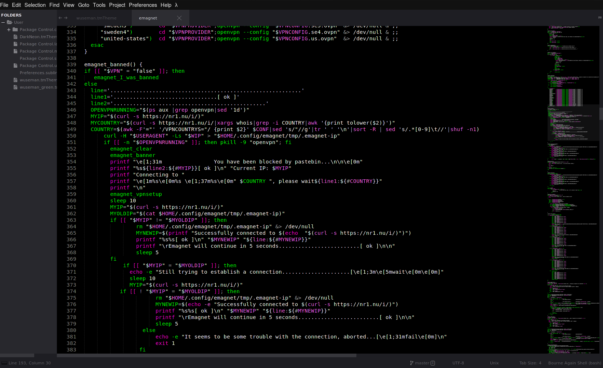

# WTHEME-SUBLIME

My color configuration for Sublime text editor. Modded for .sh syntaxes only

Colorscheme is from myself but the theme in use is Asphalt-monochrome.subltime-theme, install this theme via package control

     # For syntax colors:
     Download the wuseman.tmTheme file
     copy the tmTheme file into: ~/.config/sublime-text-3/Packages/User/
     You will now be able to use my color scheme by press Preferences/ColorScheme in toolbar
     That's it!

     # For theme:
     Press ctrl+shift
     Install Package Control
     Hit ctrl+shift again
     Search for install and choose Package Control: Install Package
     Now search for the asphalt theme or simply just use default and use my colorscheme.

## Previews

#### wuseman.tmTheme (Purple+Green+White)

#### wuseman_green.tmTheme (Green+White)

## Authors: 

* **wuseman <wuseman@nr1.nu\>** 

## License

This project is licensed under the GNU General Public License v3.0 - see the [LICENSE.md](LICENSE.md) file for details

### Contact

  If you have problems, questions, ideas or suggestions please contact me on *_wuseman@nr1.nu_  - For faster contact visit freenode irc network or the webchat and type '/msg wuseman hi!' in the input bar and I will reply you ASAP I will see the message.
  
  Enter Freenodes network via your own client 'chat.freenode.com:+6697 or use their new web client [here](https://webchat.freenode.net/)

# END
